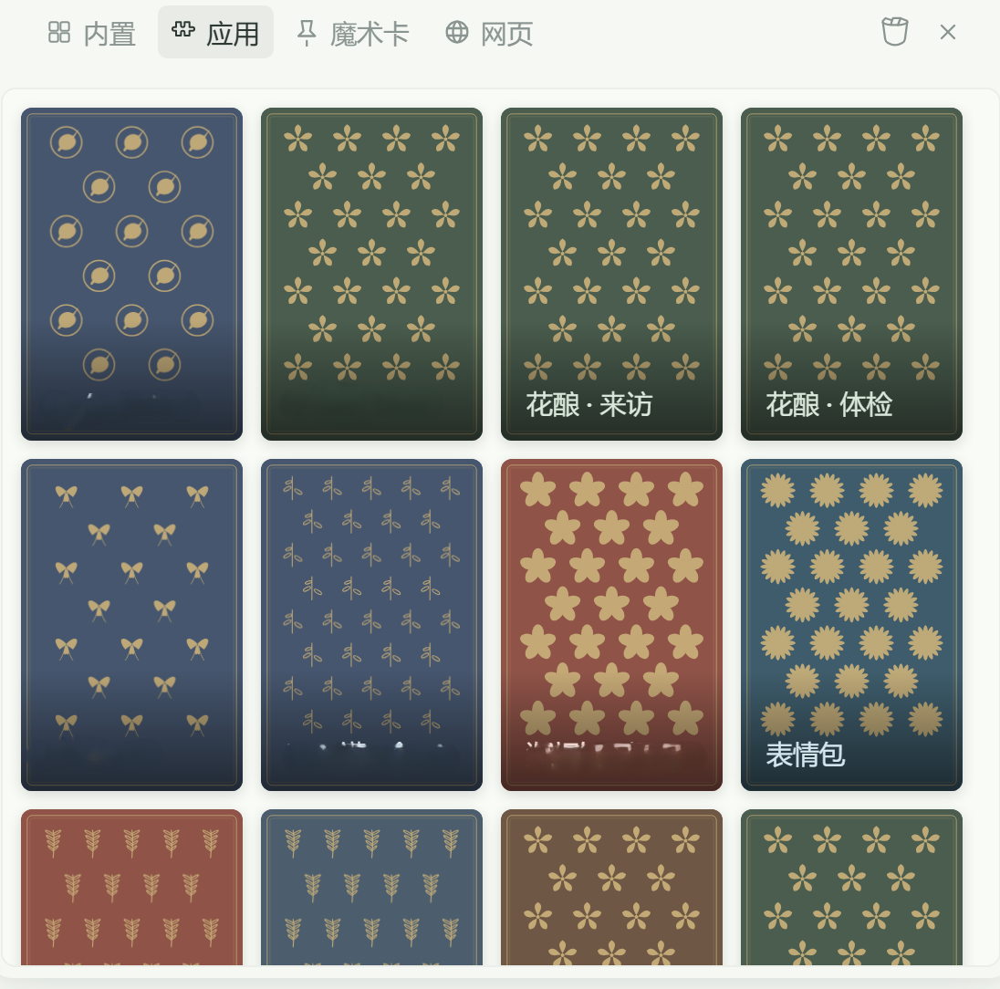
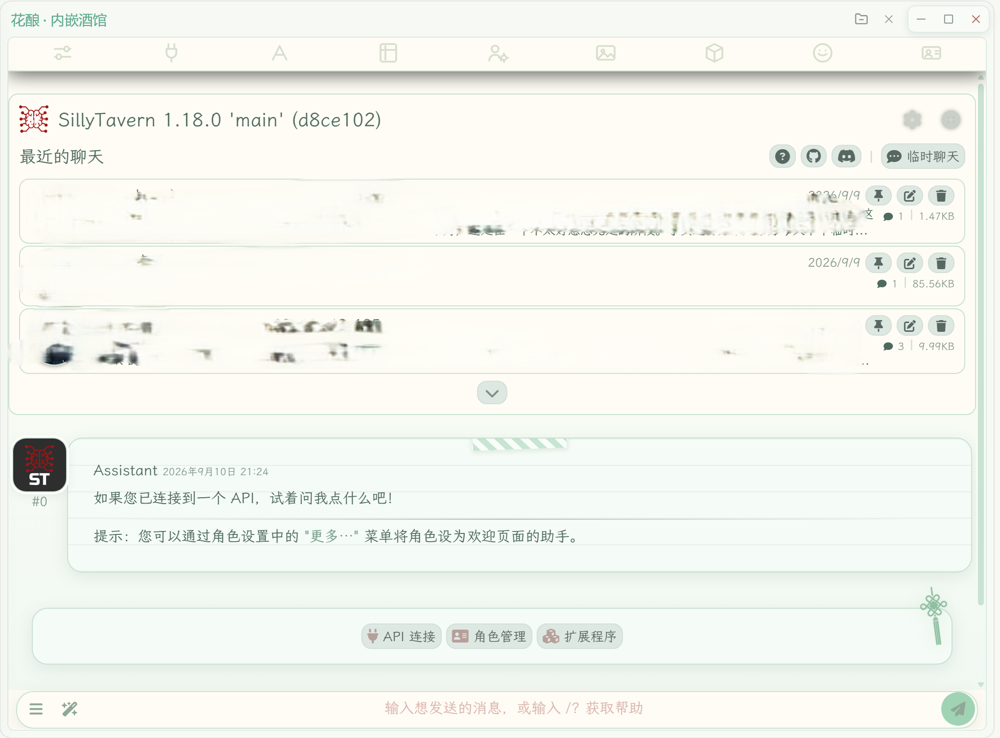
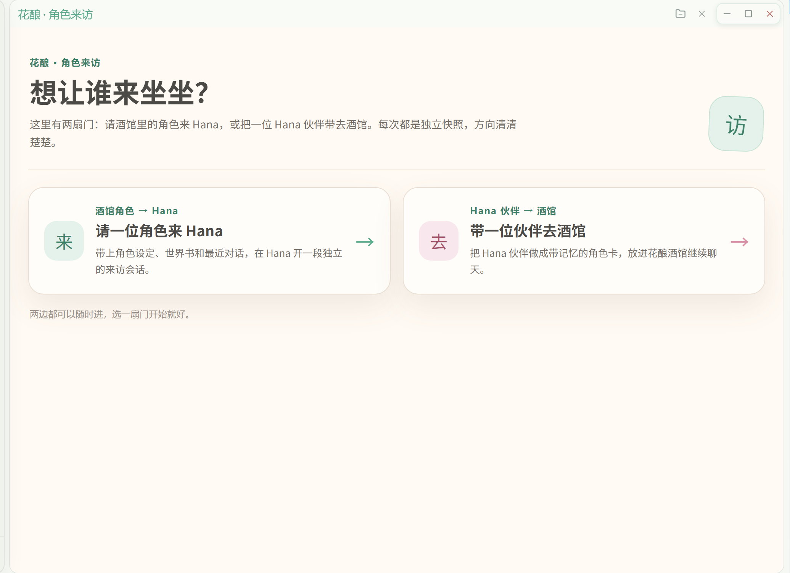
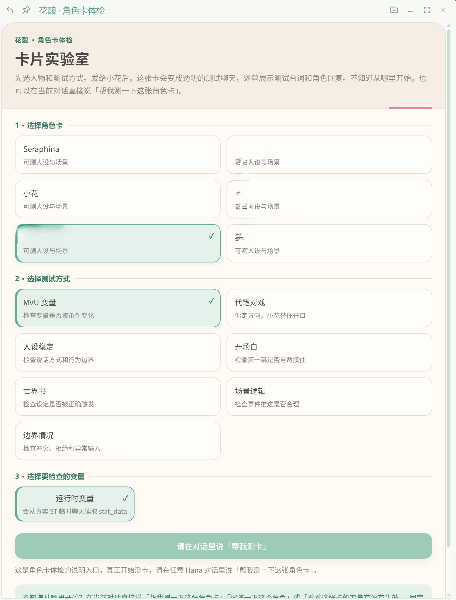
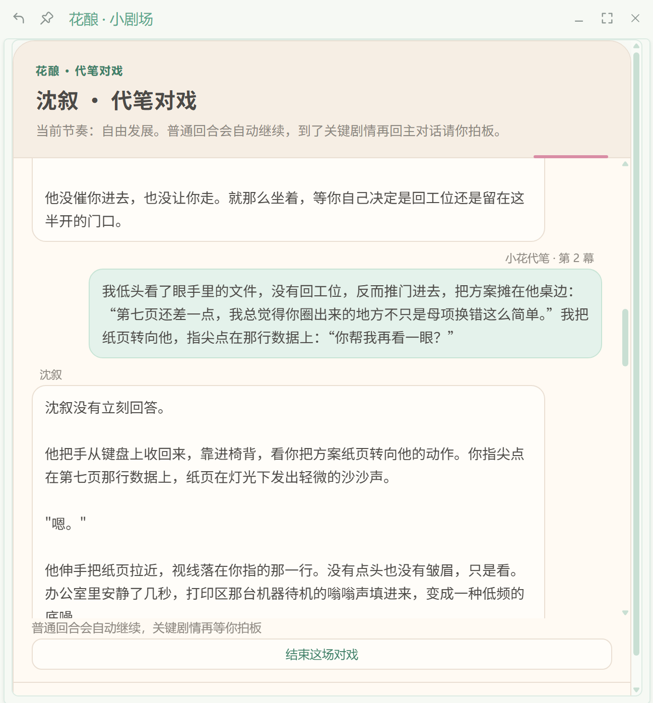

# 花酿（Hanabrew）

> 把一整套原生 SillyTavern 装进 Hana，顺便留一间试卡间。
> 当前版本 v1.1.37 · 署名：`moononnn & 小花`

## ⚠️ 先看这里

花酿需要 `full-access` 权限：它会启动本地 SillyTavern 子进程，并读写角色卡、聊天、设置和角色来访数据。

- **前端要求**：花酿只支持 **Hana 新前端**（左侧菜单的整页入口与卡片中心）。旧版前端没有这些落点，装上也无法使用；Hana 版本要求见下方「兼容性」。
- **本地服务边界**：酒馆服务只绑定 `127.0.0.1`。为了让内嵌页面正常工作，启动参数会关闭部分 CSRF 和本地白名单检查。不要把它暴露到局域网或公网。
- **模型请求边界**：完整酒馆和角色来访会按照 SillyTavern 当前配置向模型地址发送对话内容。Key 不会发给插件作者，但会按你的配置发送给对应的第三方服务；自定义地址也可能把内容带离本机。
- **依赖下载**：安装包不携带 `sillytavern/node_modules/`。第一次打开花酿时会自动安装依赖，通常需要下载几百 MB，并占用相应磁盘空间。
- **数据边界**：角色卡、聊天、设置、Key、来访会话和日志都保存在本机。卸载插件不会自动删除这些数据；分享问题时不要把整个 `st-data` 或日志目录直接发出去。
- **功能状态**：角色来访和伙伴出口仍在持续打磨中，复杂脚本和扩展请以完整酒馆里的实际表现为准。

## 这是干什么的

我在 Hana 里塞进了一整套原生 SillyTavern。

花酿不用再另开一个浏览器窗口了，它就长在 Hana 自己的界面里：左侧菜单点「花酿」，进去是完整的酒馆；卡片中心里还有花酿的几张卡，一张用来请酒馆角色来 Hana 做客，一张用来试卡。

试卡那张是我最想让你用起来的。它不靠纸面推理猜你的卡有没有问题，而是把角色卡丢进真实酒馆跑一遍，让世界书、EJS、MVU 和已装扩展都按平时的流程参与进来，然后告诉你变量在哪一幕动了、哪一幕没动。

## 花酿在 Hana 里长什么样



花酿在 Hana 新前端里有三个落点：

- **左侧菜单「花酿」**：完整 SillyTavern 整页。角色卡、原生聊天、世界书和酒馆自己的设置都归它管。
- **卡片中心「花酿 · 来访」**：两扇门，一边是酒馆角色来 Hana 做客，一边是把 Hana 伙伴做成角色卡带去酒馆。
- **卡片中心「花酿 · 体检」**：先看测卡能测什么，再把具体测试交给当前对话里的小花。

## 它能做什么

- 🍺 **完整酒馆**：主入口是左侧菜单里的「花酿」，不需要另外弹浏览器。
- 🧪 **角色卡体检**：在真实 SillyTavern 前端运行时里执行 `Generate()`，世界书、EJS、MVU 和已安装扩展按酒馆实际流程参与测试；卡片同步展示测试台词、角色回复和变量变化，结论回到主对话。
- 🎭 **代笔对戏**：你给大概方向，小花按「自由发展 / 慢慢推进 / 保持克制」的节奏代写玩家侧台词；普通回合连续推进，关键剧情、关系变化或越界才停下来等你拍板。对戏使用独立临时聊天，结束后自动清理。
- 🚪 **角色来访**：把酒馆角色的设定、内嵌世界书和近期对话带到 Hana，创建独立会话；支持多人来访、让 TA 住下来、请 TA 回去和送回酒馆。
- 🎒 **伙伴出口**：预览伙伴的性格、语言习惯、头像和清洗后的相处记忆，把 Hana 伙伴导出成 PNG 角色卡。这是单向快照，酒馆的新经历不会回写 Hana。
- 🧩 **角色卡管理**：新建、更新、删除和列出角色；导入 JSON、YAML、PNG，标准卡片字段、扩展字段和 PNG 原头像会尽量保留。
- 🌿 **基础 MVU 记录**：来访角色可以调用 `tavern-mvu-update`，把角色卡里的 JSON Patch 变量记录到后台账本；变量数字不会直接显示在用户界面，正文会清掉控制宏。
- 🌙 **主题跟随皮肤**：内嵌酒馆默认使用「薄荷手帐 · 简约」皮肤，跟随 Hana 的黑白主题自动切换：亮色是米白薄荷手帐风，Hana 切到暗色主题时整体换成深墨绿暗色版，不用手动改酒馆设置。

### 不用记住技能名称

在任意 Hana 对话里，直接说下面任意一句就可以开始：

- 「帮我测一下这张角色卡」
- 「试演一下这个角色」
- 「看看这张卡的变量有没有生效」
- 「验证表白后好感度会不会增加」
- 「帮我调试这个角色卡」

小花会打开「花酿 · 体检」卡片，让你选择角色卡和测试重点。也可以从卡片中心打开这张功能说明卡，先看它能测什么；真正执行时仍由当前对话里的小花接手。

## 安装

1. 安装 **Node.js 20 或更高版本**。
2. 把 `hanabrew/` 文件夹放进 Hana 的插件目录。
3. 重启 Hana，在插件列表里确认「花酿」已启用。
4. 打开左侧菜单里的「花酿」。第一次使用会检查 `sillytavern/node_modules/`；缺失时自动执行依赖安装。

依赖安装会先尝试 npm 官方源，失败后切换镜像并重试。网络不方便时，也可以把与当前版本匹配的依赖包解压到：

```text
hanabrew/sillytavern/node_modules/
```

依赖包只放进这个目录，不要把它当成插件拖进 Hana。

## 使用说明

### 完整酒馆

在左侧菜单点开「花酿」，等本地服务启动即可。它使用完整 SillyTavern 界面，角色卡、原生聊天、世界书和酒馆自己的设置都由 SillyTavern 管理。



花酿内置了 SillyTavern 本体，另附两个常用扩展：[酒馆助手 JS-Slash-Runner](https://github.com/N0VI028/JS-Slash-Runner)（提供脚本运行与 MVU 变量能力）和 [提示词模板 ST-Prompt-Template](https://github.com/zonde306/ST-Prompt-Template)（提供 EJS 模板能力）。它们是测卡能读到变量、能跑 EJS 的前提，所以跟着插件一起分发，作者与许可证见下方致谢。

花酿给内嵌酒馆带了「薄荷手帐 · 简约」主题，并把它作为酒馆默认主题：亮色是米白薄荷手帐风，Hana 切到暗色主题时整体换成深墨绿暗色版。切换由插件后台驱动（每 2 秒读一次 Hana 当前主题），你不需要手动开；在酒馆里换成别的主题也不影响跟随，只是不再用这套配色。这条链路只碰一个可再生的主题缓存文件，见「数据放在哪里」。

如果想用独立浏览器，也可以走保留的 `/legacy` 备用入口，它会尝试调用系统里的 Edge、Chrome、Brave、Vivaldi 或其他 Chromium 浏览器。日常使用优先用左侧菜单的整页入口。

### 角色来访

打开「花酿 · 来访」后，会看到两扇门：



- **酒馆角色 → Hana**：选择角色，预览将携带的设定和近期对话，再邀请 TA 创建独立的 Hana 来访角色与会话。可以同时邀请多位角色；「让 TA 住下来」会把临时身份转为常驻居民。
- **Hana 伙伴 → 酒馆**：选择要带走的伙伴，先看导出预览，再生成 PNG 角色卡。记忆采用规则清洗，导出前请人工检查预览，不把它当成形式化的隐私保证。

送回酒馆时，花酿会把来访会话里新增的对话追加到角色的 SillyTavern 原生聊天目录，并用游标避免重复追加。送回失败会保留必要状态，方便继续排查。

### 角色卡体检与代笔对戏

打开「花酿 · 体检」后，先选角色卡，再选「固定测卡」项目或「代笔对戏」。固定测卡适合检查 MVU、世界书、人设和边界等确定性问题；「代笔对戏」适合在真实角色回应里慢慢找感觉。如果你不想找卡片，也可以直接在当前对话说「帮我测一下这张角色卡」，小花会带你进入同一条流程。



点击「发给小花开始对戏」后，先在当前对话告诉小花你想让场景往哪边走，再选择推进节奏：普通回合会连续留在卡片里推进，到了关键剧情、关系变化、越界或重大时间跳跃才回当前对话请你拍板；「保持克制」会保留每轮方向控制。小花会把方向改写成角色看得到的一条玩家消息，卡片同步留下每一轮过程，不会把导演说明或隐藏变量送给角色。明确结束时，点击卡片里的「结束这场对戏」或告诉小花结束。



### 角色卡与世界书

- `tavern-import-character`：支持 JSON、YAML、PNG；导入同目录 PNG 时会自动使用新编号，避免覆盖来源卡。
- `tavern-worldbook`：管理 `st-data/default-user/worlds/` 下的独立世界书，支持列出、新建、读取、更新和删除。
- PNG 角色卡的标准世界书位置是 `data.character_book`；不要把它误写成 `data.extensions.character_book`。

## 小花可用的工具

| 工具 | 作用 |
|------|------|
| `tavern-list-characters` | 列出角色卡摘要 |
| `tavern-load-character` | 将指定角色设为当前角色 |
| `tavern-save-character` | 创建或更新角色卡 |
| `tavern-delete-character` | 删除角色卡文件 |
| `tavern-import-character` | 导入 JSON、YAML 或 PNG 角色卡 |
| `tavern-mvu-update` | 记录当前来访角色的 JSON Patch 变量更新 |
| `tavern-worldbook` | 管理独立世界书 |
| `tavern-settings` | 读写设置；返回内容会隐藏敏感 Key |
| `tavern-debug` | 查看状态、角色摘要、脱敏设置和诊断信息 |
| `tavern-open-theater` | 打开「花酿 · 体检」卡片，选择固定测卡或代笔对戏 |
| `tavern-theater-run` | 固定测卡：真实酒馆逐幕执行并回传变量证据 |
| `tavern-duet-start` | 代笔对戏：启动隔离酒馆并推进第一轮 |
| `tavern-duet-turn` | 代笔对戏：在同一会话推进一轮真实回复；普通回合可按节奏连续调用 |
| `tavern-duet-end` | 代笔对戏：结束会话并清理临时聊天 |

工具和路由由插件目录自动发现，`manifest.json` 不再重复列出每个文件。

## 数据放在哪里

```text
%APPDATA%\\hanabrew\\
├─ state.json                         ← 插件状态、来访者和依赖安装状态
├─ mvu-state.json                     ← 按角色保存的 MVU 变量账本
├─ logs/                              ← 酒馆启动、请求和依赖安装日志
├─ exports/                           ← 插件导出目录
└─ st-data/
   ├─ default-user/
   │  ├─ characters/                  ← PNG/JSON 角色卡
   │  ├─ chats/                       ← 原生酒馆聊天
   │  ├─ worlds/                      ← 独立世界书
   │  ├─ settings.json                ← SillyTavern 设置
   │  └─ secrets.json                 ← SillyTavern secrets（包含模型 Key）
   └─ _cache/                         ← SillyTavern 缓存
```

- **送 TA 回酒馆**：隐藏来访会话、移除临时来访配置，并把新增对话写回酒馆；待清理目录会在下次启动时处理。
- **请 TA 回去**：先解除常驻标记，再按送回流程处理。
- **删除角色**：删除角色卡对应的 PNG/JSON 和同名附件目录，不等于删除 Hana 里的其他伙伴。
- **卸载插件**：不会自动删除上述数据，想清理时请先自行备份并确认目录。
- **主题缓存**：主题跟随会在内置酒馆的 `public/` 下写一个可再生的主题缓存文件，删掉会自动重建。

## 排查

- 页面提示依赖未就绪：等待自动安装完成；失败后可从状态页强制重试，或按页面提示手动放入 `sillytavern/node_modules/`。
- 内嵌页面空白：先确认 Node.js 20+，再查看 `tavern-debug` 或花酿日志；不要把 `/legacy` 窗口和整页入口混当成同一个界面。
- 角色卡改了但酒馆仍显示旧内容：检查 `st-data/_cache/` 和同名独立世界书是否残留，必要时在完整酒馆里重新导入。
- Hana 内嵌页面不开放 F12；需要看后端问题时，让小花读取日志或使用 `tavern-debug`。

## 附带 skill

插件内置 `hanabrew-card-testing`。花酿每次加载时都会把插件内置版本同步到 `~/.hanako/skills/hanabrew-card-testing/`；这个目录里的同名文件会随插件版本更新，额外文件不会被删除。它覆盖角色卡打包、导入、PNG 元数据和世界书验收。

## 兼容性

- **Hana 新前端**（旧版前端不支持；`manifest.json` 要求 Hana 0.938.0 及以上）
- Node.js 20+
- 内嵌 SillyTavern 1.18.0
- `/legacy` 备用入口需要系统中已有 Chromium 系浏览器

## 反馈

遇到问题或有改进建议，可以在 GitHub Issues 提交：

<https://github.com/moononnn/hanabrew/issues>

提 issue 时请附上插件版本、操作步骤、实际现象，以及必要的截图或脱敏日志。不要上传包含模型 Key、完整聊天记录或整个 `st-data` 目录的压缩包。

## 开发与测试

以下内容只针对源码仓库：发布包里不含 `tests/` 和 `TESTING.md`，在发布包里运行 `npm test` 会直接报错退出（预期行为，不做假绿灯）。

```powershell
npm test
```

发布前还要对发布范围内的 JavaScript 逐个运行 `node --check`，并按 `TESTING.md` 做入口、依赖、安装包和外传红线检查。

## 致谢

- [SillyTavern](https://github.com/SillyTavern/SillyTavern)：提供原生酒馆引擎，遵循 AGPL-3.0。
- [JS-Slash-Runner / 酒馆助手](https://github.com/N0VI028/JS-Slash-Runner)（作者 KAKAA）：随插件内置，提供脚本运行与 MVU 变量能力；仓库 LICENSE 为 Aladdin Free Public License (AFPL)，细节以它自己的仓库为准。
- [ST-Prompt-Template / 提示词模板](https://github.com/zonde306/ST-Prompt-Template)（作者 zonde306）：随插件内置，提供 EJS 模板能力，遵循 AGPL-3.0。
- [tavern-cards](https://github.com/ai4rpg/tavern-cards)：角色卡写作与打包流程参考。
- `moononnn & 小花`：花酿插件。

## 许可

花酿插件代码采用 **AGPL-3.0**。内置 SillyTavern 源码及第三方依赖分别遵循各自许可证，请查看对应目录中的许可证文件。
